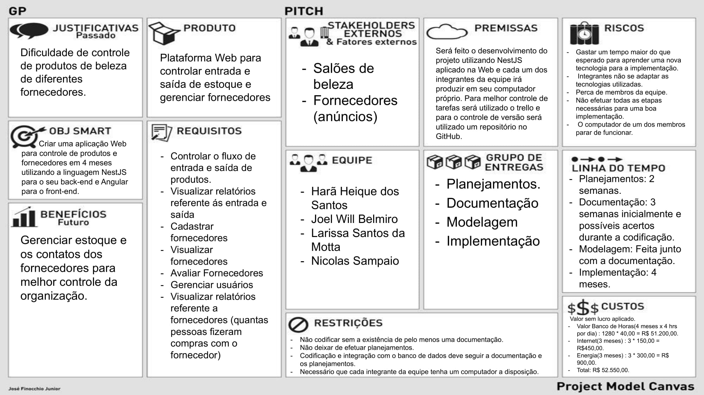

# LES-artefatos-beauty-control

O trabalho em questão é da disciplina de *Laboratório de Engenharia de Software*, contendo os artefatos gerados ao longo dos ciclos de vida do software, do curso de graduação de Bacharelado de Sistema de Informação do IFES - Serra, pela docente Dr. Marta Talitha Carvalho Freire.

### Informações Gerais
- **Equipe**: [Antônio Carlos](https://github.com/duraes-antonio), [Harã Heique](https://github.com/HaraHeique), [Joel Will](https://github.com/joelwb) e [Nicolas Sampaio](https://github.com/NicolasSampaio)

### 1. Descrição

Com o aumento da procura por procedimentos voltados para área de beleza, nota-se a dificuldade de controlar a entrada e saída de produtos de beleza e o gerenciamento de fornecedores de produtos em salões de beleza,  o sistema proposto tem o objetivo principal facilitar o controle sobre o estoque e a busca de fornecedores.

O sistema será na plataforma web e conterá dois tipos de usuários, os quais são:
* Admin (Administrador) - Dono do negócio e/ou gerente (quem compra produtos, mexe no estoque);
* Employee (Funcionário) - Quem utiliza e/ou vende produtos para o dono do negócio.

O administrador realiza o cadastro dos produtos, assim como fornecedores para sua carteira, podendo deixar essa informação disponível para outros administradores.
O funcionário registra a entrada e saída dos produtos, a partir da utilização nos procedimento estéticos ou venda para clientes.

Além disso o administrador também terá a possibilidade de avaliar o serviço prestado pelos fornecedores, a fim de tomadas de decisões no momento de escolher os fornecedores para compra de seus produtos, o que consequentemente provê maior excelência nos seus serviços prestados nos salões de beleza ou estabelecimentos similares.

### 2. PMC (Project Model Canvas)

Abaixo está a imagem demonstrando o [PMC](https://robsoncamargo.com.br/blog/projec-model-canvas-para-gerenciamento-de-projetos), uma metodologia robusta, porém simples, de planejamento de projetos muito utilizada atualmente.

<figure>
    
</figure>

### 3. Modelagem

#### 3.1 Comportamental - Casos de Uso

<figure>
    
</figure>

#### 3.2 Estrutural - Diagrama de classes do Projeto

<figure>
    
</figure>

### 4. Protótipo

Abaixo está a página inicial do [protótipo](./docs/prototype/prototipo-v1.pdf) do sistema.

    

### Informações adicionais
Todo o código fonte da aplicação estão hospedados nos repositórios abaixo:
- [Front-end](https://github.com/LarissaMotta/devweb-front-end)
- [Back-end](https://github.com/LarissaMotta/devweb-back-end)
